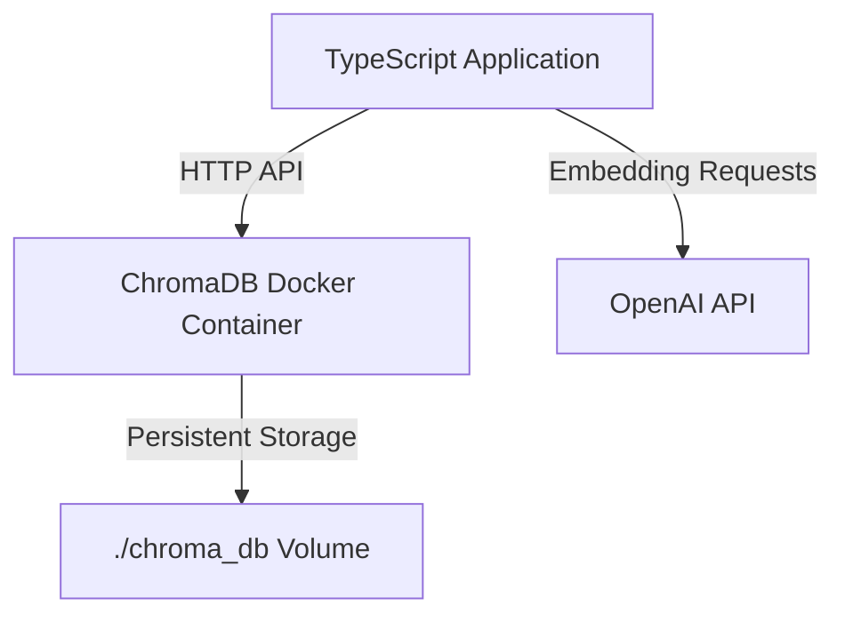

# activeContext.md

## Implementation Flow

1. Start ChromaDB server using Docker
   ```bash
   docker compose up -d
   ```
2. Load configuration and environment variables
   - Read `OPENAI_API_KEY` from `.env`
3. Initialize ChromaDB client with HTTP connection to Docker container
4. Check ChromaDB server health
5. Get or create the collection
6. Load, parse, and chunk Markdown files
7. Vectorize text using OpenAI and upsert into ChromaDB
8. Perform similarity search via CLI and display results

## Execution Method

First, ensure the ChromaDB Docker container is running:

```bash
# Start ChromaDB server (if not already running)
docker compose up -d
```

Then run the project with the following commands:

```bash
# Compile TypeScript
pnpm exec tsc

# Run the application
node dist/index.js

# Run the application on development
pnpm run dev
```

When you run the application, it will:

1. Connect to the ChromaDB server running in Docker
2. Process and embed markdown files
3. Store the results in the persistent Docker volume
4. Subsequent runs will update the existing database rather than starting from scratch

To stop the ChromaDB server:

```bash
docker compose down
```

## Docker Container Architecture



## MCP Server Integration

- Use MCP server tools for basic GitHub Flow operations (branching, commit, PR creation).
- Manual review and merge unless otherwise instructed.

## Design and Requirements for Markdown Registration Speedup

### 1. Introduce Parallel Processing
- Process Markdown files in parallel at the file level to handle multiple files simultaneously.
- Consider asynchronous parallelization for batch OpenAI embedding generation and ChromaDB upsert.

### 2. Optimize Batch Sizes
- Dynamically adjust batch sizes for OpenAI embedding API to reduce the number of API calls.
- Optimize batch sizes for ChromaDB upsert to reduce communication overhead.

### 3. Review Delays and GC Calls
- Reassess the current 100ms delay and GC calls to eliminate unnecessary wait times.
- Implement dynamic GC call strategies based on memory usage.

### 4. Optimize Docker Resource Settings
- Review CPU and memory allocation for Docker containers to prevent delays caused by resource shortages.
- Adjust Docker Compose settings as needed.
