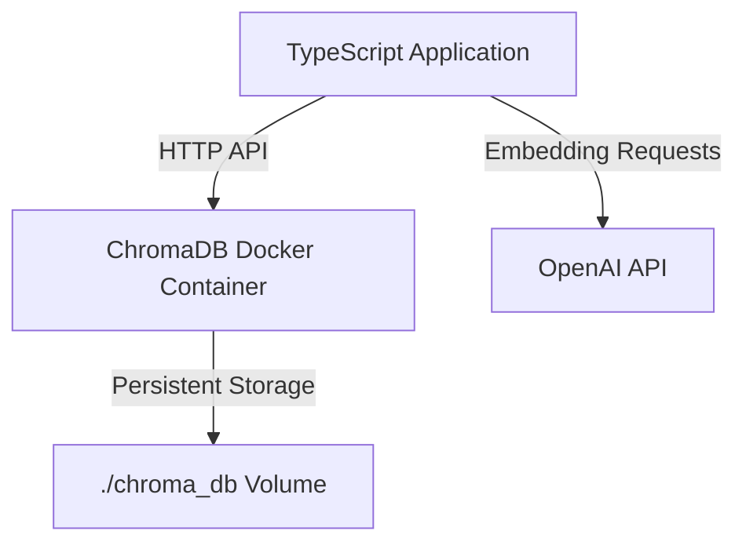

# activeContext.md

## Implementation Flow

1. Start ChromaDB server using Docker
   ```bash
   docker compose up -d
   ```
2. Load configuration and environment variables
   - Read `OPENAI_API_KEY` from `.env`
3. Initialize ChromaDB client with HTTP connection to Docker container
4. Check ChromaDB server health
5. Get or create the collection
6. Load, parse, and chunk Markdown files
7. Vectorize text using OpenAI and upsert into ChromaDB
8. Perform similarity search via CLI and display results

## Execution Method

First, ensure the ChromaDB Docker container is running:

```bash
# Start ChromaDB server (if not already running)
docker compose up -d
```

Then run the project with the following commands:

```bash
# Compile TypeScript
pnpm exec tsc

# Run the application
node dist/index.js

# Run the application on development
pnpm run dev
```

When you run the application, it will:

1. Connect to the ChromaDB server running in Docker
2. Process and embed markdown files
3. Store the results in the persistent Docker volume
4. Subsequent runs will update the existing database rather than starting from scratch

To stop the ChromaDB server:

```bash
docker compose down
```

## Docker Container Architecture



## MCP Server Integration

- Use MCP server tools for basic GitHub Flow operations (branching, commit, PR creation).
- Manual review and merge unless otherwise instructed.

## Design and Requirements for Markdown Registration Speedup

### 1. Introduce Parallel Processing
- Process Markdown files in parallel at the file level to handle multiple files simultaneously.
- Limit parallelism to CPU cores minus one to avoid resource contention.
- Consider dynamic parallelism control based on file size or processing time.

### 2. Optimize Batch Sizes
- Dynamically adjust batch sizes for OpenAI embedding API based on memory usage.
- Increase minimum batch size to reduce API call frequency.
- Optimize batch sizes for ChromaDB upsert to reduce communication overhead.
- Consider additional metrics like CPU load and API rate limits for batch size adjustment.

### 3. Review Delays and GC Calls
- Remove unnecessary fixed delays (e.g., 100ms wait).
- Implement dynamic GC call strategies based on memory usage thresholds.
- Reduce GC call frequency to minimize processing pauses.
- Tune Node.js memory settings to alleviate GC pressure.

### 4. Optimize Docker Resource Settings
- Allocate sufficient CPU cores and memory (recommend 4 cores, 4GB+ RAM).
- Optimize Docker volume mounts and network settings for better I/O performance.
- Set environment variables for ChromaDB to improve performance:
  - `CHROMA_DB_IMPL=duckdb+parquet`
  - `CHROMA_COLLECTION_CACHE_SIZE=1024`

## Performance Degradation Analysis and Improvement Proposals

### Possible Causes of Performance Degradation
- Overhead of parallel processing causing resource contention.
- Aggressive batch size reduction increasing API call frequency.
- Frequent GC invocations causing intermittent pauses.
- Insufficient Docker resource allocation.
- Inefficient file reading and chunk generation.
- OpenAI API response latency and rate limiting.
- Excessive logging causing I/O bottlenecks.

### Improvement Proposals
- Optimize parallelism level and implement dynamic control.
- Refine batch size adjustment strategy with additional metrics.
- Optimize GC invocation frequency and Node.js memory settings.
- Increase Docker CPU and memory allocation.
- Improve file processing efficiency and chunking logic.
- Cache embeddings and optimize API usage.
- Control logging verbosity and use asynchronous logging.

## Updated Design and Requirements for Further Optimization

### Embedding Model
- Continue using `text-embedding-3-small` as per current implementation.
- Consider future upgrade to `text-embedding-3-large` with resource increase.

### Batch Size and Memory Limits
- Increase batch size limits in code to improve throughput.
- Adjust Node.js memory limits (e.g., `--max-old-space-size=16384`) to allow larger batch processing.
- Recommend increasing Docker container memory allocation to at least 4GB.
- Recommend increasing CPU allocation to 4 cores or more for better parallelism.

### Chunk Size and Token Limits
- Increase chunk sizes closer to OpenAI token limits to reduce total chunk count.
- Balance chunk size to maintain semantic relevance and search accuracy.

### Docker Configuration
- Update `docker-compose.yml` to increase CPU and memory limits:
  - CPUs: 4
  - Memory: 4GB or higher
- Optimize Docker volume mounts and network settings for improved I/O.

### Implementation Notes for Developers
- Update batch size constants in `src/embedding/openai.ts` and `src/processor.ts`.
- Adjust Node.js runtime options in `package.json` scripts or deployment environment.
- Coordinate Docker resource allocation changes with infrastructure team or deployment scripts.
- Monitor memory usage and GC behavior after changes to fine-tune parameters.

---

This merged update consolidates all previous investigations and recent findings into a single, coherent document for implementers to follow.
