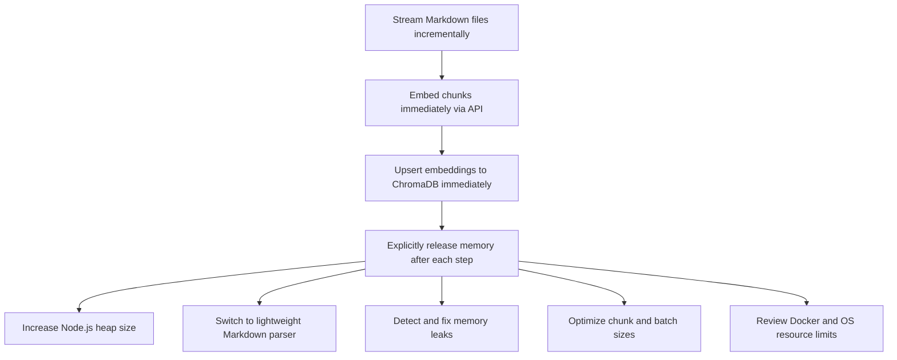

# Comprehensive Analysis and Solutions for Memory Error in Markdown Indexing

## 1. Background and Current Situation

- The project is a TypeScript application that chunks Markdown files, vectorizes them using OpenAI embedding API, and stores them in ChromaDB.
- The memory error (JavaScript heap out of memory) occurs mainly during Markdown parsing, chunking, and vectorization.
- Existing mitigations such as increasing Node.js memory limits, reducing batch and chunk sizes, simplifying Markdown parsing, processing files one by one, and dummy data tests have not fully resolved the issue.

---

## 2. Hypothesized Causes and Corresponding Solutions

### A. Node.js Memory Limits and Garbage Collection

- **Hypothesis**: Default heap size is insufficient or garbage collection is not effective.
- **Solutions**:
  - Increase heap size with `NODE_OPTIONS=--max-old-space-size=8192` or higher.
  - Use explicit `global.gc()` calls with `--expose-gc` Node.js option.
  - Explicitly dereference unused objects by setting them to `null` to aid GC.

---

### B. Memory Consumption in Markdown Parsing and Chunking

- **Hypothesis**: The markdown-it parser or similar is consuming excessive memory when processing large or many files at once.
- **Solutions**:
  - Replace markdown-it with a more memory-efficient parser such as remark, marked, or micromark.
  - Use regex-based or streaming approaches for Markdown-to-text conversion.
  - Avoid loading entire files into memory; process them incrementally using Node.js streams.

---

### C. Chunk Size, Batch Size, and Concurrency

- **Hypothesis**: Large chunk sizes or batch sizes cause high temporary memory usage.
- **Solutions**:
  - Further reduce chunk size (e.g., to 250 characters or less).
  - Reduce batch size to 1 for sequential API requests.
  - Process files and chunks sequentially, releasing memory after each.

---

### D. Memory Leaks and Object References

- **Hypothesis**: References to arrays or objects persist, preventing garbage collection.
- **Solutions**:
  - Explicitly set arrays and objects to `null` after use.
  - Use proper scoping to avoid closures holding references.
  - Use memory leak detection tools like heapdump or memwatch-next.

---

### E. File I/O and Streaming Processing

- **Hypothesis**: Entire files are loaded into memory at once.
- **Solutions**:
  - Use `fs.createReadStream` to read files line-by-line or in chunks.
  - Process and embed chunks immediately, then release memory.

---

### F. OpenAI Embedding API Usage

- **Hypothesis**: Multiple chunks are sent in a single request, and responses are held in memory.
- **Solutions**:
  - Send one chunk per API request and upsert immediately.
  - Discard API responses promptly to free memory.

---

### G. ChromaDB Communication Overhead

- **Hypothesis**: Data duplication or buffering during communication increases memory use.
- **Solutions**:
  - Avoid sending unnecessary data during upsert.
  - Clear buffers or caches after communication.

---

### H. Environment and Docker Resource Constraints

- **Hypothesis**: Docker or OS resource limits restrict available memory.
- **Solutions**:
  - Verify and increase Docker container memory limits.
  - Check OS-level resource limits (e.g., ulimit).
  - Confirm environment variables like `NODE_OPTIONS` are correctly set.

---

### I. Architectural Considerations

- **Hypothesis**: Current architecture is not optimal for large-scale data processing.
- **Solutions**:
  - Implement worker queues or distributed processing.
  - Use temporary storage or databases to avoid holding all data in memory.
  - Consider local embedding models to reduce API calls.

---

## 3. Recommended Action Plan (Priority Order)

1. Introduce streaming file processing to avoid loading entire files.
2. Increase Node.js heap size to at least 8GB.
3. Replace markdown-it with a more memory-efficient parser.
4. Optimize chunk and batch sizes for minimal memory footprint.
5. Use memory leak detection tools to identify leaks.
6. Adjust Docker and OS resource limits as needed.
7. Consider architectural changes for scalability.

---

## 4. Additional Considerations

- Handle large files and many files by splitting processing into smaller units or separate processes.
- Implement error recovery to resume processing after failures.
- Balance performance and memory usage by tuning chunk sizes and concurrency.
- Plan for future extensions such as Web UI or multimodal data support with memory efficiency in mind.

---

## 5. Summary

- The root cause is loading and processing too much data in memory simultaneously.
- Streaming, sequential processing, and explicit memory management are key.
- Existing mitigations are helpful but insufficient alone.
- A combination of memory limit increases, parser optimization, and architectural improvements is recommended.
